# **Herramienta de Optimización del Sistema**

## **1. Introducción**

Hoy en día la mayoría de personas disponen al menos de un computador con sistema operativo Windows en casa, ya sea para trabajo, estudio, entretenimiento, gaming, etc. Por ello siempre van a querer que sus computadoras y su sistema operativo funcionen de la mejor manera. Ahora existe software de terceros que ayudan a optimizar el sistema operativo, por esta razón en el presente trabajo se hablara de una aplicación en específico, que cuenta con varias funciones, las cuales ayudaran a mantener nuestro sistema operativo funcionando como recién instalado.

Windows 10 es el sistema operativo de Windows más avanzado para usuarios domésticos y profesionales por igual. Cuenta funciones potentes y la mejor interfaz de usuario de cualquier sistema operativo de Windows hasta la fecha. Se usa en la mayoría de computadoras actuales y por ello hay que mantenerlo optimizado gracias a la aplicación Wise Care 365.

Wise Care 365 es software diseñado para cuidar nuestro computador. Como utilidad de puesta a punto, Wise Care 365 tiene varias funcionalidades, es práctica y económica. Siempre mantendrá el computador en las mejores condiciones y con el mejor rendimiento.

## **2. Desarrollo** 
    
### **2.1 Características principales**

***2.1.1 Análisis del PC***

Esta interfaz se divide en 6 áreas de operación:

- Compruebe la salud del PC.
- Historial de limpiezas y ajustes realizados.
- Programar tarea de limpieza.
- Utilidades.

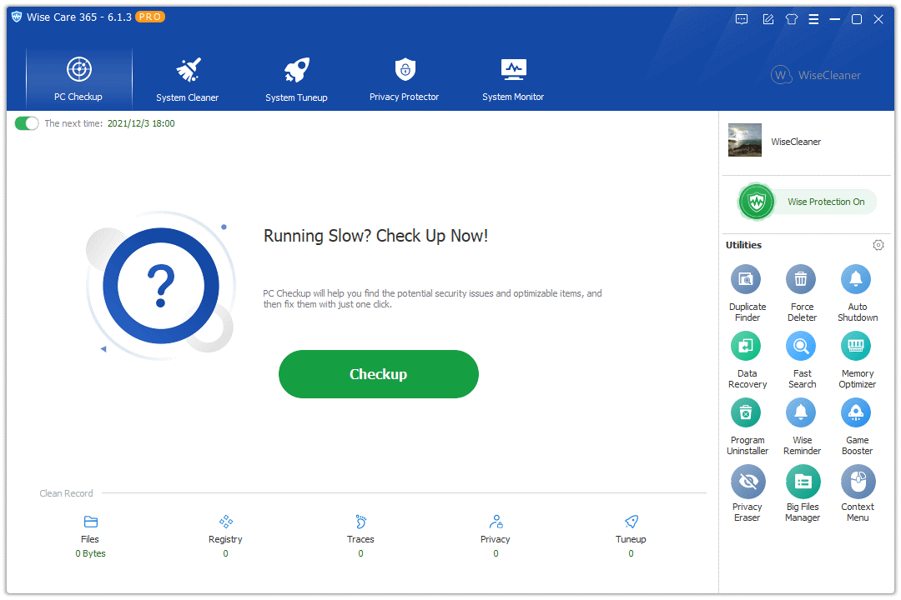

***2.1.2 Limpieza del Sistema***

- **Limpiador de registro.**

Escanea y limpia entradas de registro no válidas en el sistema informático, como componentes Activex y COM no válidos, información de extensión de archivo no válida, biblioteca de enlaces dinámicos compartida faltante, información de desinstalación inútil o no válida, etc.

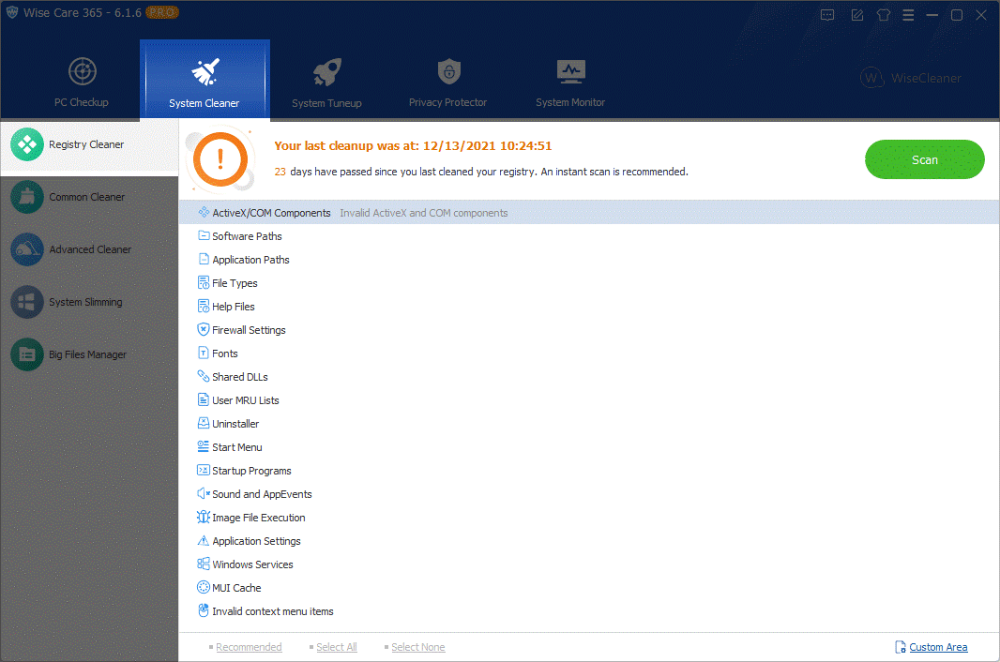

- **Limpiador Común.**

Limpia archivos inútiles en el disco del sistema, como archivos de registro, archivos de caché de miniaturas, archivos de actualización de Windows, archivos de caché del navegador, historial del navegador, cookies, contraseñas guardadas del navegador, archivos temporales creados por varias aplicaciones de terceros (Adobe, Office, etc.), etc.

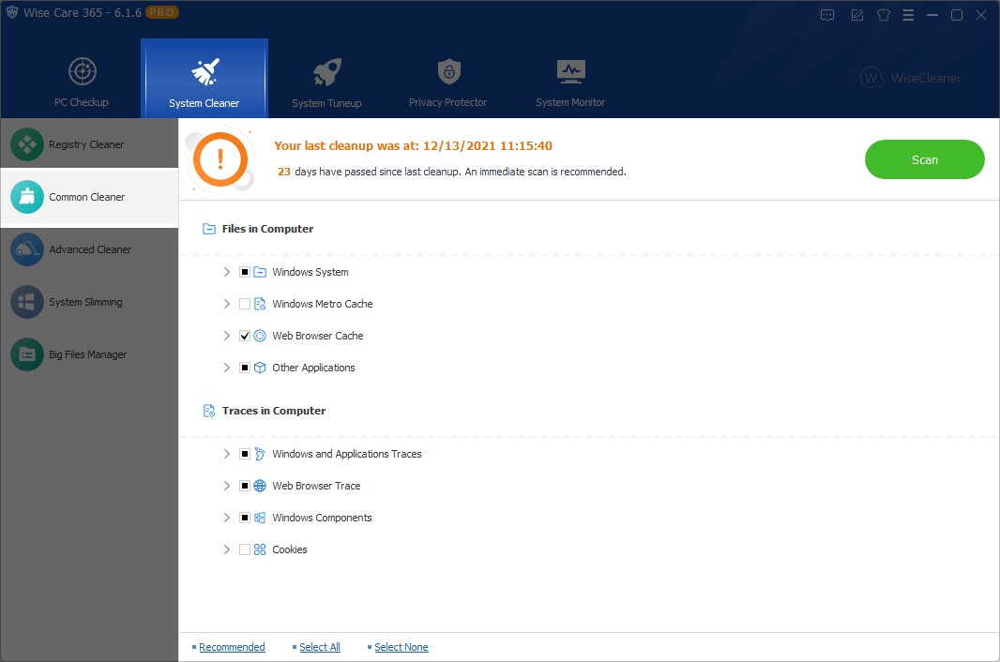

- **Limpiador Avanzado.**

Escanea y limpia archivos específicos en una o todas las unidades locales y discos extraíbles. También admite vaciar carpetas específicas.

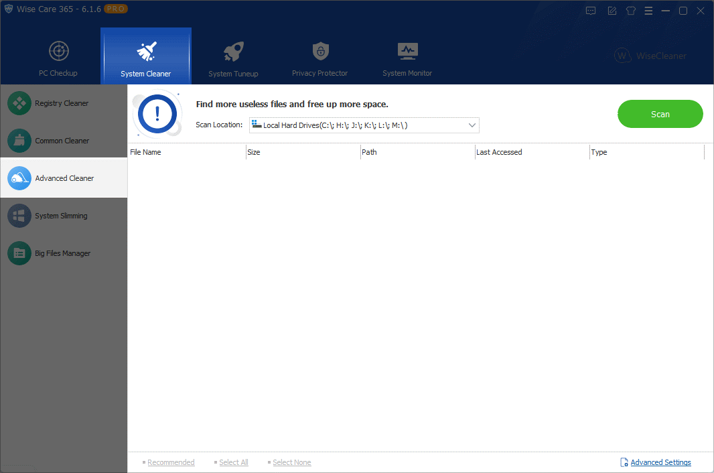

- **Reducir Tamaño.**

Sin afectar la estabilidad y seguridad del sistema, elimina algunos archivos específicos del sistema para liberar espacio en el disco del sistema. Puede limpiar los siguientes elementos:

    - Archivos de instalación descargados de Windows. (recomendado)
    - Caché de línea base de Windows Installer. (recomendado)
    - Muestra de música/imágenes/videos/medios de Windows. (recomendado)
    - Archivos de fondo de pantalla de Windows. (Opcional)
    - Archivos de ayuda de Windows. (Opcional)
    - Archivos IME. (opcional) 

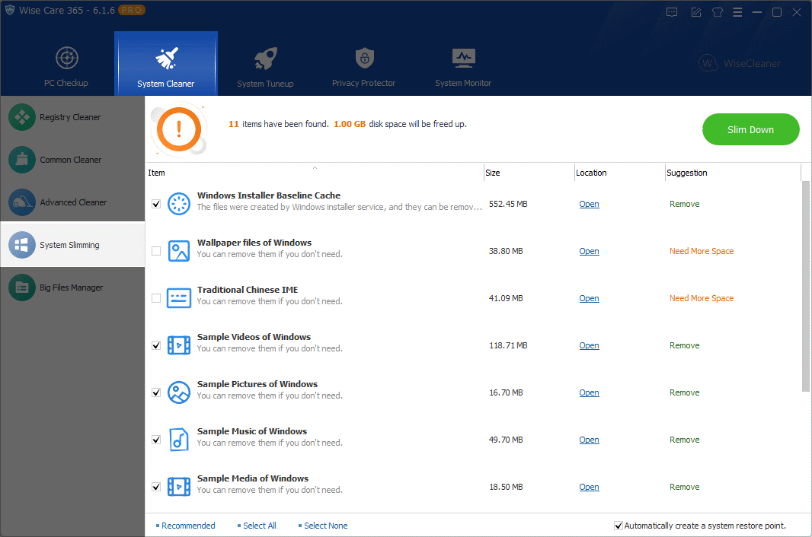    

- **Administrador de archivos grandes.**

A través del Administrador de archivos grandes encuentra archivos de más de 10 MB en la ubicación especificada. Los usuarios pueden optar por eliminar estos archivos grandes para liberar más espacio libre.

Solo enumera los archivos de más de 10 MB, no significa que todos estos archivos se puedan eliminar de forma segura. Depende del usuario decidir qué archivos eliminar.

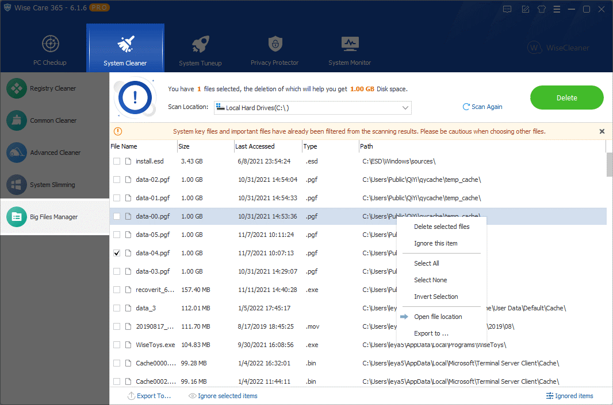   

***2.1.3 Optimización del Sistema***

- **Optimizador del Sistema.**

Acelerará la velocidad de inicio y apagado del sistema, ajustará la estabilidad del sistema y mejorará la velocidad de acceso a la red. Algunos elementos de optimización entrarán en vigor después de reiniciar.

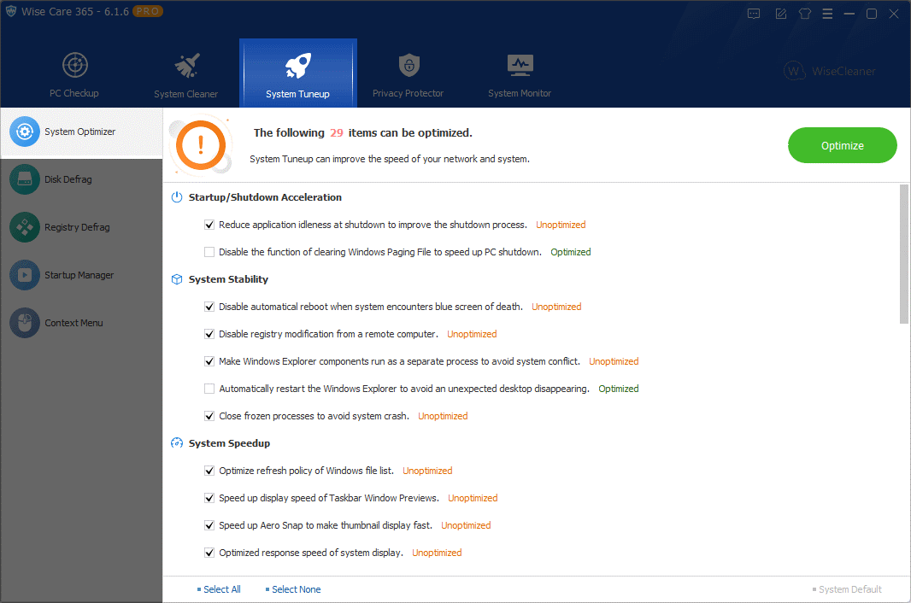  

- **Desfragmentar el Disco.**

Admite la desfragmentación y optimización de discos duros para hacer que el almacenamiento de archivos sea más compacto, mejorando así el rendimiento del sistema y la velocidad de ejecución.

También puede utilizar la tecnología TRIM para optimizar la SSD, mejorar el rendimiento de la SSD y prolongar la vida útil.

  

- **Desfragmentar el Registro.**

Puede analizar y comprimir fragmentos de registro redundantes. Un registro limpio y ordenado puede aumentar efectivamente la velocidad del sistema.

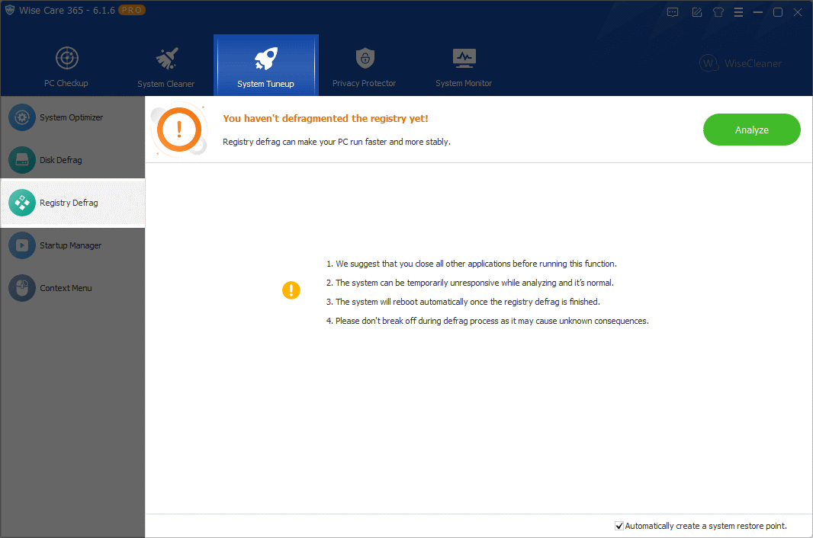  

- **Administrar el inicio.**

Cuando se inicia el sistema, algún software se ejecutará automáticamente, esto ralentizará la velocidad de inicio del sistema. El Administrador de inicio puede cerrar estos programas que se ejecutan automáticamente para acelerar la velocidad de inicio del sistema.

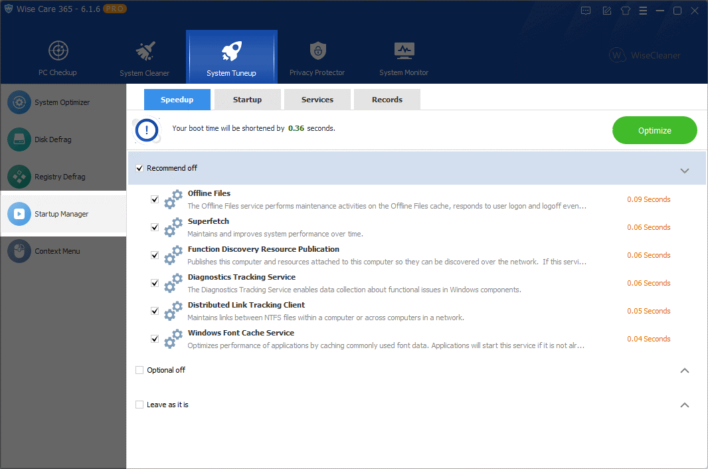 

- **Menú Contextual.**

Cuando hace clic con el botón derecho en un archivo, una carpeta o un icono de acceso directo, puede abrir el menú contextual.

La función de gestión del menú del botón derecho de Wise Care 365 puede cerrar fácilmente los programas innecesarios para que no se muestren en el menú contextual, lo que aumenta la velocidad de funcionamiento del sistema.

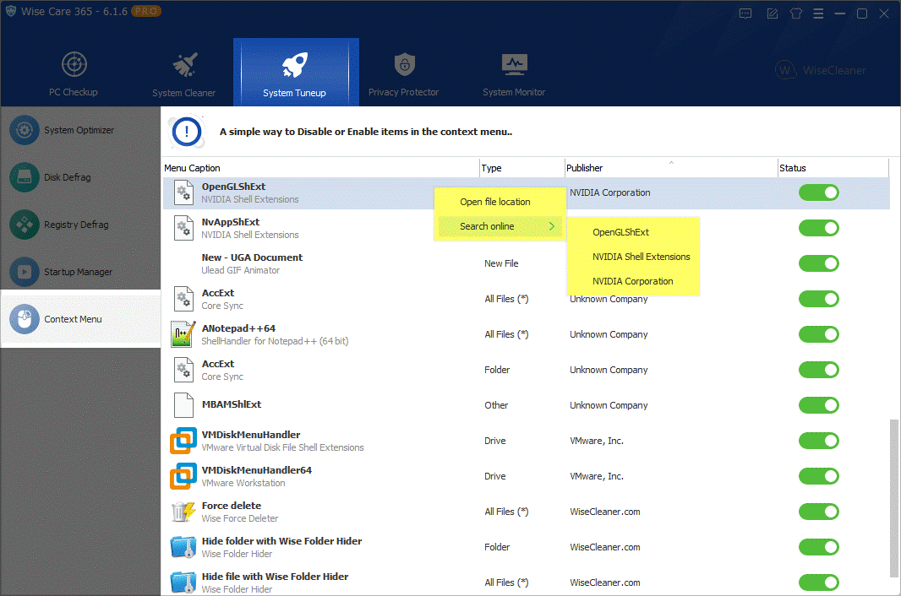 

***2.1.4 Privacidad del Sistema***

- **Limpiar la privacidad.**

El borrador de privacidad puede eliminar el historial de imágenes que ha visto, películas y videos vistos, archivos visitados, páginas visitadas, etc.

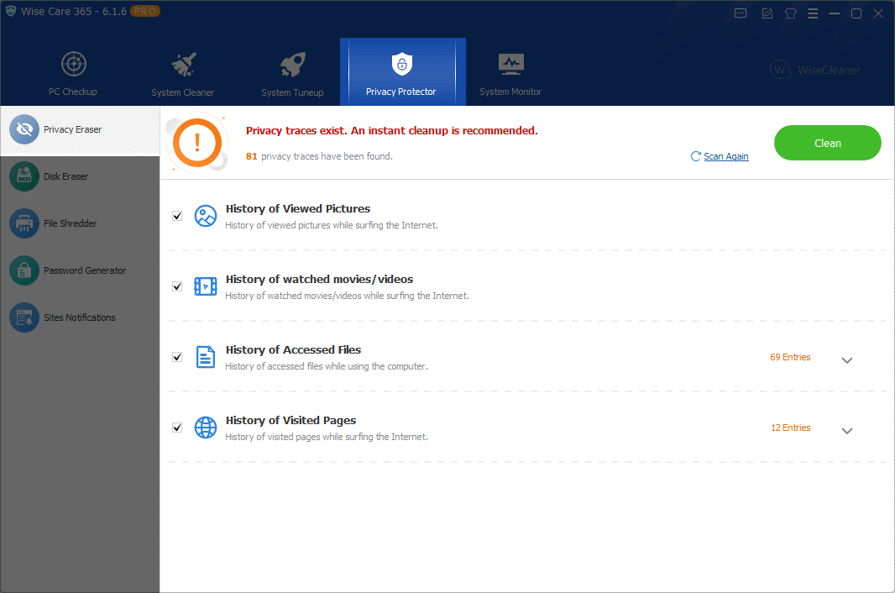 

- **Sobreescribir discos.**

El borrador de disco de Wise Care 365 llena el espacio restante del disco creando una gran cantidad de archivos de 0 bytes, destruyendo la integridad de los archivos eliminados, reduciendo la capacidad de recuperación de los archivos eliminados y protegiendo su privacidad.

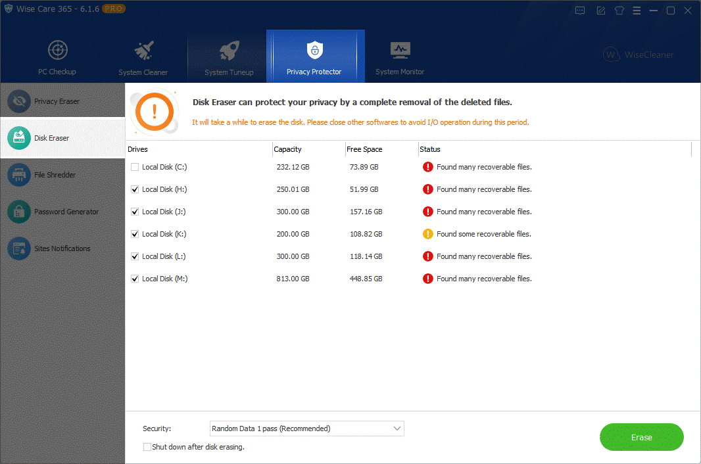 

- **Sobreescribir archivos.**

Elimina los archivos y carpetas, luego crea archivos de 0 bytes para llenar la ubicación y reducir la capacidad de recuperación de los archivos y carpetas eliminados.

 

- **Generar contraseña.**

El generador de contraseñas puede crear contraseñas aleatorias y mostrar el nivel de seguridad de la contraseña.

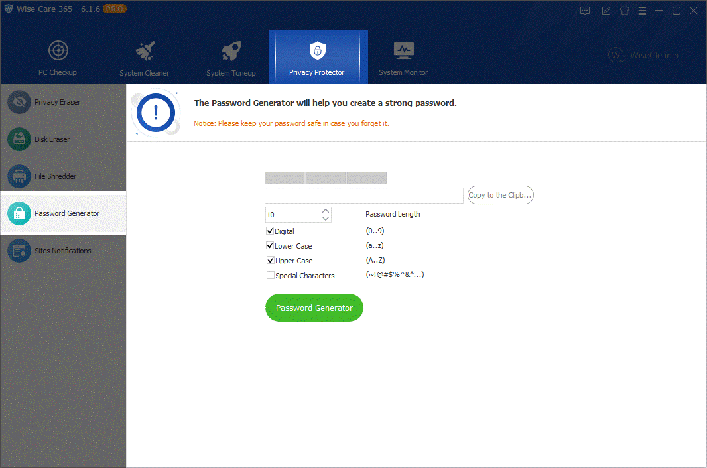 

- **Notificaciones de sitios.**

Los sitios generalmente envían notificaciones para informarle sobre noticias de última hora o mensajes de chat. Con Notificaciones de sitios, puede administrar fácilmente los sitios que le envían notificaciones.

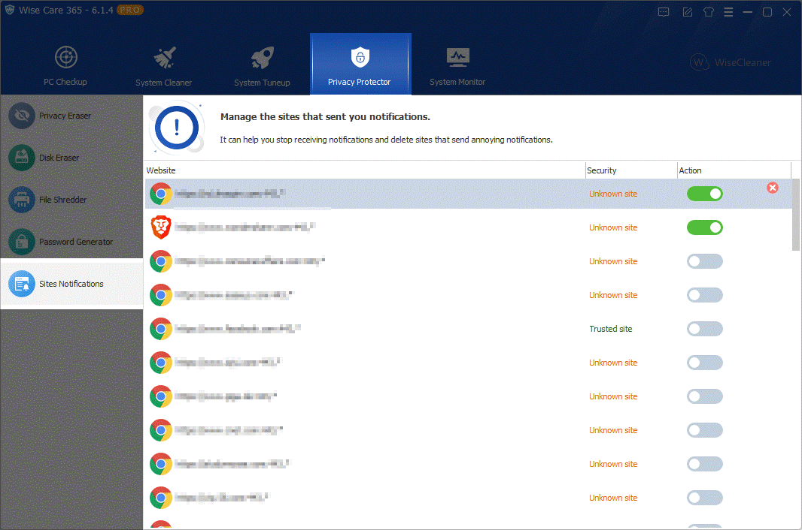 

***2.1.5 Monitor del Sistema***

- **Monitor de procesos.**

Puede mostrar los procesos del sistema que se están ejecutando actualmente, incluidos los procesos del sistema y los procesos del usuario.

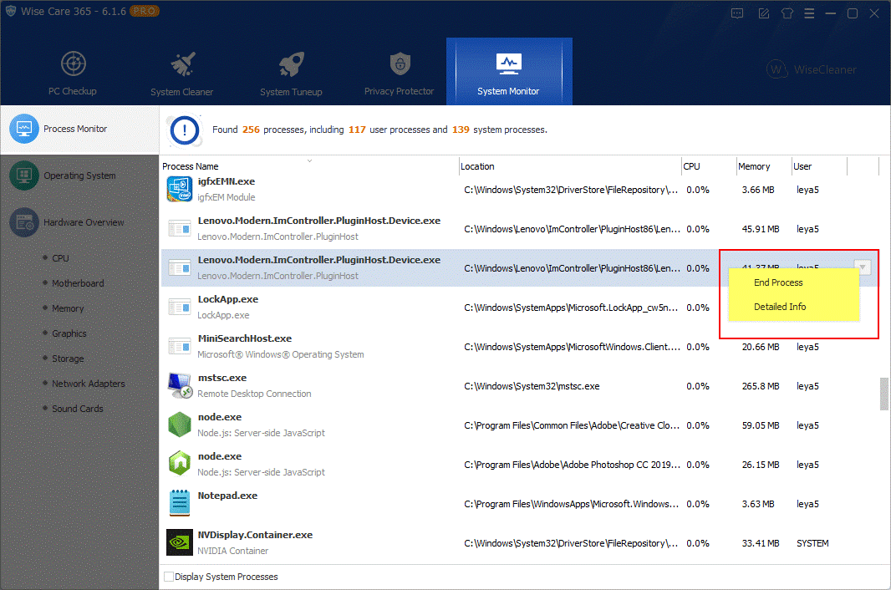 

- **Sistema operativo.**

En esta pestaña, puede obtener una descripción general del sistema operativo, como la versión del sistema operativo, la clave del producto, el número de compilación, la zona horaria, la región y el formato.

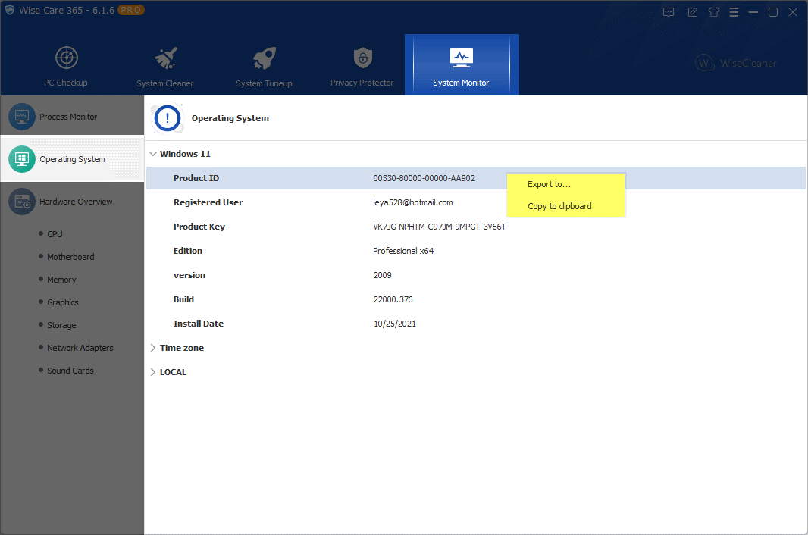 

- **Hardware.**

A través del panel de descripción general del hardware, puede ver la información básica del hardware de la computadora, como la CPU, la placa base, la memoria, el almacenamiento, los gráficos, el adaptador de red y la tarjeta de sonido.

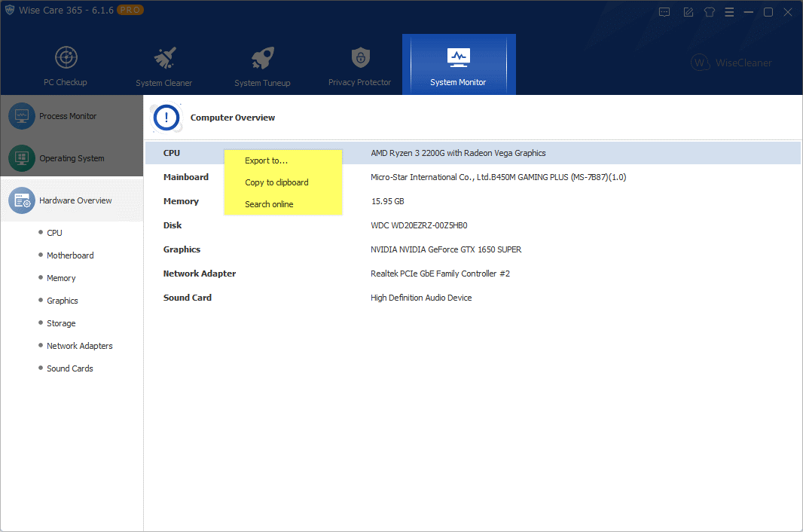 

## **Conclusiones**
Con la ayuda de este software enfocado para la optimización del sistema se puede llegar a solucionar varios problemas sin ser necesario formatear la computadora, no solo eso, sino que también cuenta con otras funciones muy interesantes y muy útiles, como por ejemplo nos brinda más seguridad, información de nuestro computador, entre otras.

Una de las cuestiones que hay que aclarar es que este software tiene una versión gratuita y de paga, aunque la versión gratuita es superbuena, claro que si se quiere obtener mejores funcionalidades es mejor comprarla.

Concluyo que, es super práctica y muy intuitiva, cualquier persona con conocimientos básicos de computación podría usarla, ya que la misma indica para qué sirve cada una de las tantas funciones que dispone y nos brinda advertencias para no cometer algún error.

## **Bibliografía** 
Welcome · Wise Care 365 Manual. (2022, 12 enero). WiseCleaner. https://www.wisecleaner.com/help/wisecare365/
